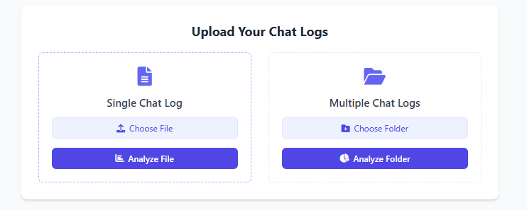

# 🧠 Chat Log Summarizer (Flask + NLP)

This project is a **Flask-based web application** that uses **Natural Language Processing (NLP)** to analyze and summarize text-based chat logs.

It can:
- Process chat conversations in `.txt` format
- Perform sentiment analysis
- Extract named entities (like names, locations, dates)
- Identify top keywords and topics
- Handle both single and multiple file uploads

---

## ✨ Features

- 🧾 Upload chat files in `User:` / `AI:` format
- 📊 Summarizes total messages, average length, and message count by speaker
- 😃 Sentiment analysis using **VADER**
- 🏷 Named entity recognition via **spaCy**
- 🔑 Keyword and topic extraction using **TF-IDF + NLTK**
- 🧰 Batch processing for multiple `.txt` chat logs
- 🌐 CORS-enabled for integration with web apps

---

## 📁 Chat File Format Example

Each line should follow this pattern:

Set up a virtual environmen:
python -m venv venv
source venv/bin/activate     # On Windows: venv\Scripts\activate
pip install -r requirements.txt

Download spaCy model:
python -m spacy download en_core_web_sm

    

👤 Author
Ishtiak
For help or suggestions, feel free to contact or contribute.

---

## 📦 Downloadable ZIP

✅ I’ve bundled everything into a downloadable ZIP with:
- `app.py`  
- `templates/index.html`  
- `README.md`  
- Folder structure

Let me know if you'd like:
- A `Dockerfile`  
- API-only mode  
- Deployment instructions (e.g., Heroku, Render, AWS)  
- UI design improvements

